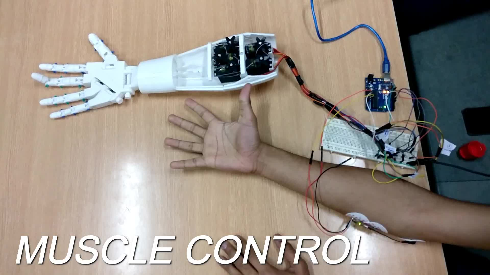
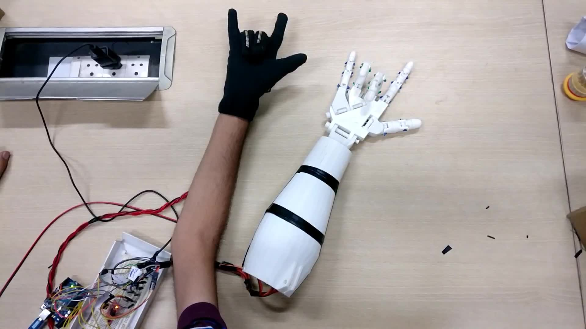
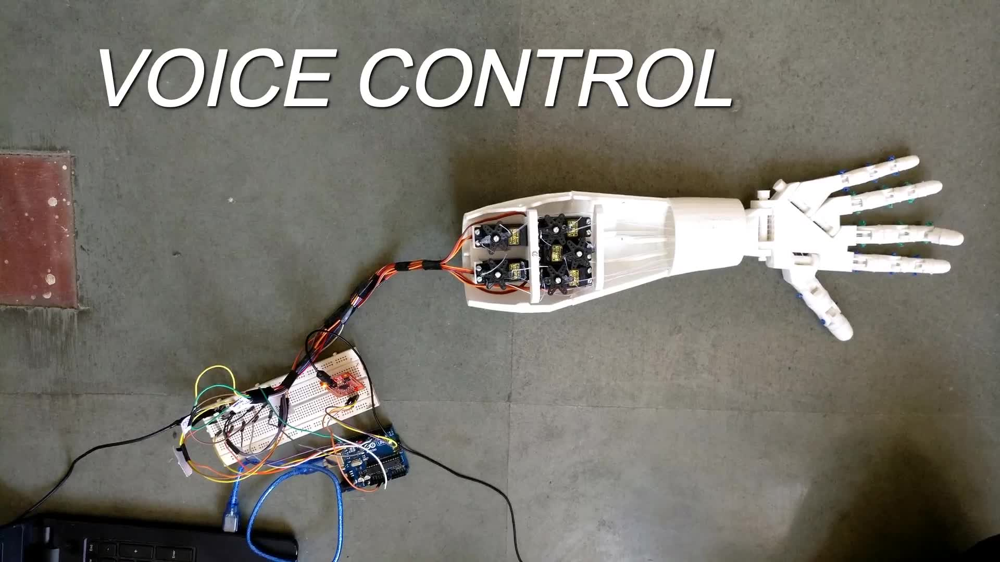

# Samurai
3D printed humanoid hand capable of grasping and holding objects and can be controlled via muscle sensors, voice sensors and remote control. Useful for amputees and extreme climate conditions. Controlled by Arduino Board.

## Muscle Control

## Glove Control

## Voice Control

